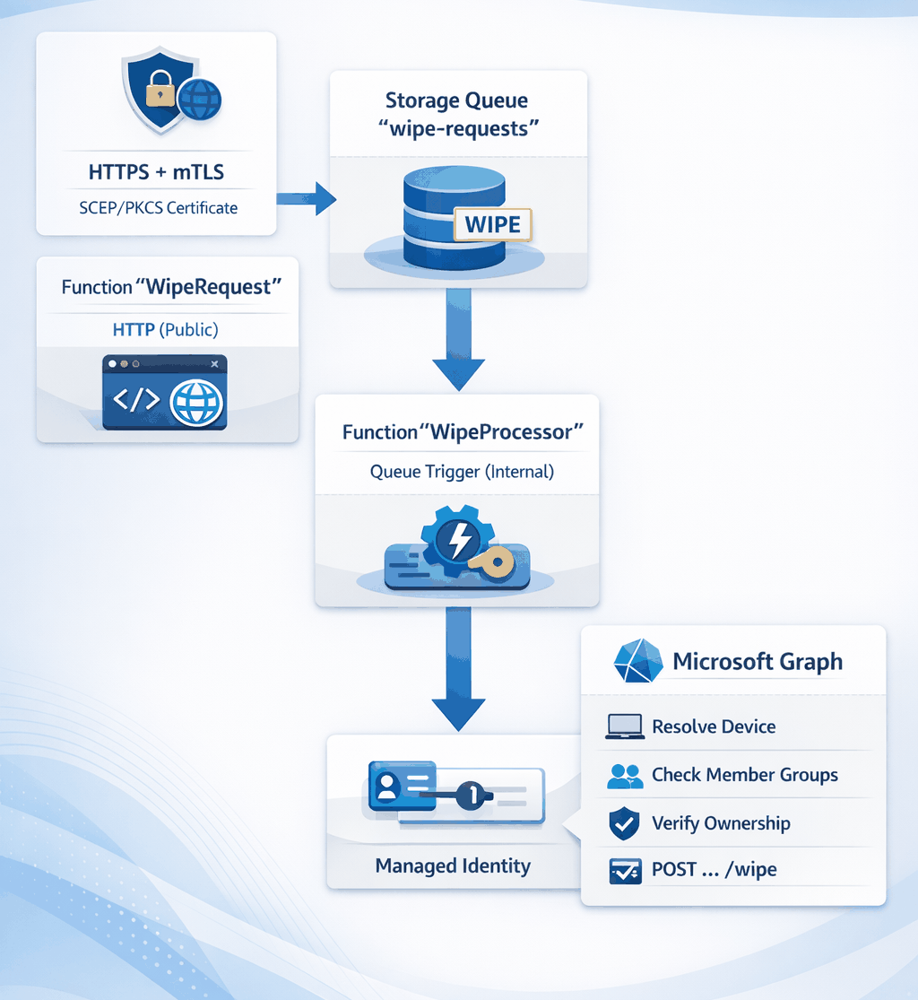
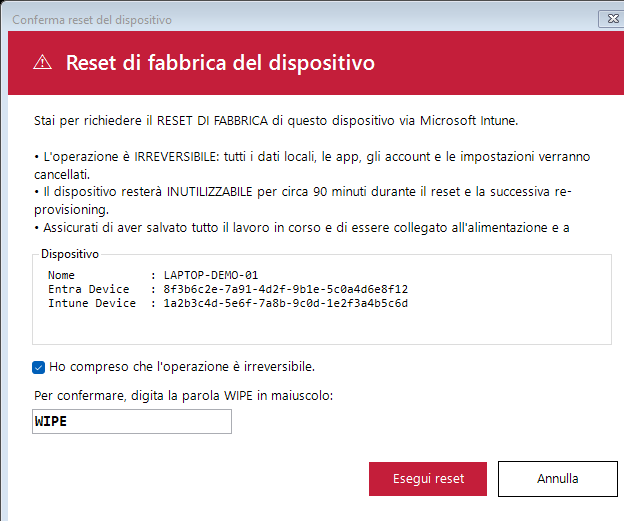

# Intune Device Self-Wipe API

[](https://dotnet.microsoft.com/)
[](https://learn.microsoft.com/azure/azure-functions/)
[](https://learn.microsoft.com/azure/azure-resource-manager/bicep/)
[](LICENSE)

> Soluzione serverless end-to-end per consentire ad un dispositivo Windows gestito da Intune di richiedere in autonomia il proprio **wipe (factory reset)**, con difesa in profondità: certificato dispositivo Intune (mTLS), allow-list nativa via gruppo Entra ID, validazione di ownership, esecuzione asincrona via coda e audit completo.

## Indice

- [Architettura](#architettura)
- [Componenti](#componenti)
- [Controlli di sicurezza](#controlli-di-sicurezza-in-profondit%C3%A0)
- [Permessi Microsoft Graph](#permessi-microsoft-graph)
- [Quickstart deploy](#quickstart-deploy)
- [Uso del client PowerShell](#uso-del-client-powershell-51)
- [API](#api)
- [Configurazione](#configurazione)
- [Osservabilità & audit](#osservabilità--audit)
- [Struttura del repository](#struttura-del-repository)
- [Roadmap](#roadmap)
- [Licenza](#licenza)

## Architettura

<p align="center">
  
</p>

L'endpoint pubblico fa **solo** validazione (certificato + payload) e
accodamento. L'esecuzione effettiva avviene in un secondo processo,
disaccoppiato e ritentabile, che applica i controlli di autorizzazione
e chiama Microsoft Graph.

## Componenti

| # | Componente | Ruolo |
|---|---|---|
| 1 | **`Invoke-DeviceWipe.ps1`** (PowerShell 5.1) | Raccoglie identità device, mostra UI WinForms di conferma (irreversibilità + ~90 min di indisponibilità + parola `WIPE` da digitare), invoca l'API in mTLS con timestamp + nonce anti-replay. |
| 2 | **`WipeRequest`** (HTTP Function) | Valida headers anti-replay, valida cert client (X509 chain + EKU + CRL opzionale), verifica binding cert↔device, valida payload, accoda messaggio, risponde `202 Accepted` con `correlationId`. |
| 3 | **Azure Storage Queue** `wipe-requests` | Disaccoppia ricezione ed esecuzione; retry automatici, dead-letter su `wipe-requests-poison`. |
| 4 | **`WipeProcessor`** (Queue trigger, non esposta) | **Dispatcher sottile**: valida formato + app role, traduce il messaggio in un `ActionDispatchMessage{ActionType="wipe"}` e lo accoda su `action-dispatch`. Nessuna logica di business: gli step di wipe vivono dentro `WipeActionRunner`. |
| 4b | **Azure Storage Queue** `action-dispatch` | Coda del router plug-in. Decouple il dispatcher dai runner concreti; nuove capability (lock, BitLocker rotate, ...) si aggiungono come nuovo `IActionRunner` senza toccare HTTP, queue o dispatcher. |
| 4c | **`ActionDispatch`** (Queue trigger, non esposta) | **Router** plug-in: deserializza la busta, risolve l'`IActionRunner` per `ActionType` via `ActionRunnerRegistry`, esegue. Onorare `FailOnError` per la retry policy della coda. |
| 4d | **`WipeActionRunner`** (`IActionRunner`, Type="wipe") | Logica wipe: risolve device Entra, verifica membership gruppo, verifica ownership Intune↔Entra, **riserva slot idempotency su blob ledger**, esegue `POST /deviceManagement/managedDevices/{id}/wipe`, inizializza status tracker, esegue nudges (sync + reboot) best-effort. |
| 5 | **Blob `wipe-ledger`** | Ledger idempotency: un blob per `intuneDeviceId` con stato `Reserved`/`Issued`/`Failed` per garantire un singolo wipe anche a fronte di retry queue at-least-once. |
| 6 | **Due User-Assigned Managed Identity** | `uami-web` (Function App pubblica) ha **solo** `Storage Queue Data Message Sender` sulla coda — niente Graph. `uami` (worker) ha `Storage Blob Data Owner` + `Storage Queue Data Contributor` + i consent Microsoft Graph. Anche se la superficie pubblica venisse compromessa, l'attaccante non può pilotare il wipe via Graph. |
| 7 | **Application Insights** | Audit completo con `correlationId`. |

### Architettura plug-in (router + runner)

```text
HTTP / mTLS  ──▶  WipeRequest  ──▶  [wipe-requests]  ──▶  WipeProcessor (DISPATCHER)
                                                                  │ enqueue ActionDispatchMessage{type="wipe"}
                                                                  ▼
                                                          [action-dispatch]
                                                                  │
                                                                  ▼
                                                          ActionDispatch (ROUTER)
                                                                  │ ActionRunnerRegistry.Resolve(type)
                                                                  ▼
                                                          ┌────────────────────────┐
                                                          │ WipeActionRunner       │  Type="wipe"        (built-in)
                                                          │ LockActionRunner       │  Type="lock"        (futuro)
                                                          │ BitLockerRotateRunner  │  Type="bitlocker"   (futuro)
                                                          └────────────────────────┘
                                                                 ▲
                                                                 │ aggiungi qui per nuove capability
```

Le risorse **CORE** (HTTP function, queue `wipe-requests`/`action-dispatch`,
`WipeProcessor`, `ActionDispatch`) non vanno mai modificate per aggiungere
una nuova capability: il contratto è la busta `ActionDispatchMessage` e
l'interfaccia `IActionRunner`.

#### Aggiungere un nuovo action runner

1. Crea una classe in `src/Actions/Runners/` che implementa `IActionRunner`:
   ```csharp
   public sealed class LockActionRunner : IActionRunner
   {
       public string Type => "lock";
       public async Task RunAsync(ActionDispatchMessage env, CancellationToken ct)
       {
           var payload = env.Payload.Deserialize<LockPayload>();
           // ... logica + audit + idempotency a piacere
       }
   }
   ```
2. Registralo in `Program.cs`:
   ```csharp
   services.AddSingleton<IActionRunner, LockActionRunner>();
   ```
3. Aggiungi un producer (nuovo endpoint HTTP, o estensione di `WipeRequest`)
   che enqueue una `ActionDispatchMessage{ActionType="lock", Payload=...}`
   via `ActionDispatchEnqueuer`.

Nessuna modifica a `WipeRequestFunction`, `WipeProcessorFunction`,
`ActionDispatchFunction`, alle code o al Bicep. Eventi audit dedicati:
`action.dispatch.enqueued`, `action.dispatch.received`, `action.dispatch.completed`,
`action.dispatch.runner-failed`, `action.dispatch.no-runner`,
`action.dispatch.invalid-envelope`.

### Isolamento delle due Function App

L'API HTTP pubblica e il worker che chiama Microsoft Graph girano in **due
Function App distinte** (`*-web-*` e `*-proc-*`) su **due App Service Plan
Linux EP1 separati** (`*-plan-web-*` e `*-plan-proc-*`), con identità,
permessi, **storage account separati** e configurazione separata.
Stesso pacchetto deployato su entrambe: i due setting
`AzureWebJobs.WipeProcessor.Disabled=1` (web) e
`AzureWebJobs.WipeRequest.Disabled=1` (worker), più il guard in-code
`AppRoleGuard` (legge `App__Role`), selezionano quale function è attiva
su quale app. Risultato:

- La app pubblica scrive sul proprio `AzureWebJobsStorage` (`*stw*`) e non ha
  alcun permesso sullo storage del worker (`*stp*`) tranne `Queue Data Message
  Sender` **scoped sulla singola coda** `wipe-requests` — non può
  leggere/cancellare messaggi, non può toccare il ledger di idempotenza,
  non può sovrascrivere il pacchetto deployato del worker.
- Il worker ha `Storage Blob Data Owner` + `Storage Queue Data Contributor`
  solo sul proprio storage account.
- I due plan separati significano **VM host distinti**: un eventuale escape
  di sandbox / vulnerabilità host-level sulla superficie pubblica non vede
  il processo del worker né il suo token UAMI cached in memoria.
- Anche se la superficie pubblica venisse compromessa, l'attaccante non può
  pilotare Graph, manomettere il ledger, né iniettare codice nel worker.

## Controlli di sicurezza in profondità

Una richiesta deve superare **tutti** questi controlli, nell'ordine:

1. **TLS mutual auth** a livello platform (`clientCertMode: Required`) — handshake rifiutato senza cert
2. **Function key** sull'HTTP call (`x-functions-key`)
3. **Anti-replay**: `X-Request-Timestamp` (skew ±5 min) + `X-Request-Nonce` (GUID, dedup cache)
4. **X509 chain validation** del cert client: validità, EKU `Client Authentication`, chain build con `CustomTrustStore` pinnato su CA Intune SCEP/PKCS, pinning per thumbprint CA, **CRL/OCSP** opzionale
5. **Cert ↔ device binding**: il claim configurato del cert (default `Subject CN`) deve uguagliare `entraDeviceId` nel body → previene IDOR
6. **Payload ben formato** (tre GUID validi)
7. **Device presente** nell'Entra ID del tenant
8. **Device membro** (anche transitivo) del gruppo di sicurezza Entra autorizzato → allow-list nativa, integrabile con membership dinamica
9. **Ownership match**: `managedDevice.azureADDeviceId` deve uguagliare l'`entraDeviceId` dichiarato
10. **Idempotency reservation** sul blob ledger (conditional `If-None-Match: *`) → un solo wipe per device anche con retry
11. **Solo allora** viene chiamata l'API di wipe Microsoft Graph; errori 4xx permanenti non vengono ritentati

Inoltre: HTTPS-only, TLS 1.2 minimo, `clientCertEnabled = true`,
Managed Identity con permessi minimi, nessuna credenziale in codice.

## Permessi Microsoft Graph

Assegnati come **application permissions** alla Managed Identity (richiede consent admin):

- `DeviceManagementManagedDevices.PrivilegedOperations.All`
- `DeviceManagementManagedDevices.Read.All`
- `Device.Read.All`
- `GroupMember.Read.All` _(per `checkMemberGroups`)_

## Quickstart deploy

### Prerequisiti

- Azure subscription + permessi `Owner` o `Contributor` + `User Access Administrator` sul RG (per le role assignment)
- Tenant con Intune e CA SCEP/PKCS che emette certificati ai dispositivi
- `az` CLI ≥ 2.60, `dotnet` SDK 10
- Un gruppo di sicurezza Entra ID che conterrà i device autorizzati al self-wipe

### 1. Crea il gruppo Entra (se non esiste)

```pwsh
$groupId = az ad group create `
  --display-name 'Intune-Wipe-Authorized' `
  --mail-nickname 'IntuneWipeAuthorized' `
  --description 'Devices authorized to request self-wipe' `
  --query id -o tsv
```

### 2. Deploy infrastruttura

```pwsh
az group create -n rg-intwipe-dev -l westeurope
az deployment group create `
  -g rg-intwipe-dev `
  -f infra/main.bicep `
  -p infra/main.parameters.json `
  -p allowedGroupId=$groupId `
  -p trustedCaThumbprints='<THUMB_ROOT_OR_INTERMEDIATE>'
```

> **Importante**: `trustedCaThumbprints` (o `trustedCaCertificatesBase64`) **deve** essere valorizzato: senza un trust anchor configurato la validazione cert fallisce in modo fail-closed.

Output utili: `webAppName`, `webAppHostname`, `procAppName`, `procAppHostname`, `uamiWorkerPrincipalId`, `uamiWebPrincipalId`, `storageWebAccount`, `storageProcAccount`, `wipeQueueName`, `ledgerContainerName`.

### 3. Concedi i permessi Graph alle Managed Identity

L'UAMI del worker (`uamiWorkerPrincipalId`) riceve **tutti** i consent Graph
(necessari per la chiamata di wipe). L'UAMI web (`uamiWebPrincipalId`) riceve
**solo** `Device.Read.All` — strettamente richiesto dalla modalità di binding
`SanDnsLookup` (risoluzione directory per certificati AD CS che portano
identità AD invece di EntraDeviceId). `Device.Read.All` è read-only e non
concede capacità distruttive: il privilege boundary del wipe (che richiede
`DeviceManagementManagedDevices.PrivilegedOperations.All`) ora vive solo
sulla **wipe-runner Function App dedicata** (UAMI `uamiWipe`). Il worker
(`uamiWorker`) ora si occupa solo del routing/forwarding: NON serve più
concedergli i ruoli privilegiati Graph (mantenerli temporaneamente non
crea rischi, ma per ottenere il privilege boundary completo è raccomandato
rimuoverli dopo il cutover — vedi sezione "Cutover privilegi" più sotto).

Se non userai mai `SanDnsLookup` (cert SCEP/PKCS Intune nativi con
`{{AAD_Device_ID}}`), puoi omettere il consent su `uamiWebPrincipalId` — il
modulo va in fail-closed loggando un warning.

```pwsh
$wipePrincipalId   = '<uamiWipePrincipalId   dall''output>'
$webPrincipalId    = '<uamiWebPrincipalId    dall''output>'
$graphSpId         = az ad sp list --filter "appId eq '00000003-0000-0000-c000-000000000000'" --query "[0].id" -o tsv

function Grant-GraphAppRole($principalId, $roleValue) {
  $rid = az ad sp show --id $graphSpId --query "appRoles[?value=='$roleValue'].id | [0]" -o tsv
  $body = "{`"principalId`":`"$principalId`",`"resourceId`":`"$graphSpId`",`"appRoleId`":`"$rid`"}"
  $tmp = New-TemporaryFile; $body | Set-Content -Encoding ascii $tmp
  az rest --method POST `
    --uri "https://graph.microsoft.com/v1.0/servicePrincipals/$principalId/appRoleAssignments" `
    --headers "Content-Type=application/json" --body "@$($tmp.FullName)"
  Remove-Item $tmp
}

# Wipe-runner (dedicated): full Graph scope for wipe execution
foreach ($r in @(
  'DeviceManagementManagedDevices.PrivilegedOperations.All',
  'DeviceManagementManagedDevices.Read.All',
  'Device.Read.All',
  'GroupMember.Read.All'
)) { Grant-GraphAppRole $wipePrincipalId $r }

# Web: ONLY Device.Read.All (read-only directory enumeration for SanDnsLookup)
Grant-GraphAppRole $webPrincipalId 'Device.Read.All'
```

**Cutover privilegi (post-deploy Option-2):** una volta che la wipe-runner
app è operativa, puoi revocare i ruoli Graph privilegiati al worker per
chiudere completamente il privilege boundary:

```pwsh
$workerPrincipalId = '<uamiWorkerPrincipalId dall''output>'
$assignments = az rest --method GET `
  --uri "https://graph.microsoft.com/v1.0/servicePrincipals/$workerPrincipalId/appRoleAssignments" `
  --query "value[?resourceId=='$graphSpId'].id" -o tsv
foreach ($a in ($assignments -split "`n" | Where-Object { $_ })) {
  az rest --method DELETE `
    --uri "https://graph.microsoft.com/v1.0/servicePrincipals/$workerPrincipalId/appRoleAssignments/$a"
}
```

### 4. Pubblica il codice su entrambe le Function App

Lo stesso pacchetto va su entrambe; i due `AzureWebJobs.*.Disabled` (settati
dal Bicep) garantiscono che ciascuna app esegua solo la function di sua
competenza.

```pwsh
cd src
dotnet publish -c Release -o ./publish
Compress-Archive -Path ./publish/* -DestinationPath ./publish.zip -Force
az functionapp deployment source config-zip `
  -g rg-intwipe-dev -n <webAppName>  --src ./publish.zip
az functionapp deployment source config-zip `
  -g rg-intwipe-dev -n <procAppName> --src ./publish.zip

# Verifica post-deploy che il selector sia attivo su entrambe le app
az functionapp config appsettings list -g rg-intwipe-dev -n <webAppName>  --query "[?name=='AzureWebJobs.WipeProcessor.Disabled'].value" -o tsv
az functionapp config appsettings list -g rg-intwipe-dev -n <procAppName> --query "[?name=='AzureWebJobs.WipeRequest.Disabled'].value"   -o tsv
```

### 5. Aggiungi device al gruppo allow-list

```pwsh
$deviceObjId = az ad device list --filter "deviceId eq '<entraDeviceId>'" --query "[0].id" -o tsv
az ad group member add --group $groupId --member-id $deviceObjId
```

## Uso del client PowerShell 5.1

Distribuibile via Intune (Win32 app, esecuzione in contesto SYSTEM) oppure
eseguibile manualmente:

```powershell
.\client\Invoke-DeviceWipe.ps1 `
  -ApiUrl       'https://<func>.azurewebsites.net/api/wipe' `
  -CertificateSubjectLike '*Intune MDM Device CA*' `
  -FunctionKey  '<function-key>'
```

Lo script:

1. Legge l'**Entra Device Id** da `dsregcmd /status`
2. Legge l'**Intune Device Id** (`DeviceClientId`) dal registro
   `HKLM:\SOFTWARE\Microsoft\Enrollments\*`
3. Mostra una finestra WinForms con:
   - intestazione rossa di warning
   - dettagli del dispositivo
   - avviso esplicito di irreversibilità e ~90 minuti di downtime
   - checkbox di consapevolezza obbligatoria
   - input testuale che richiede di digitare `WIPE` per abilitare il bottone

   <p align="center">
     
   </p>

4. Sceglie il certificato dispositivo da `Cert:\LocalMachine\My`
5. Invoca l'API con `Invoke-RestMethod -Certificate` e mostra il
   `correlationId` per riferimento al supporto

Usa `-Silent` per scenari unattended (test).

## API

### `POST /api/wipe`

Headers obbligatori:

- `x-functions-key: <function-key>`
- `Content-Type: application/json`
- mutual TLS con certificato dispositivo Intune

Body:

```json
{
  "deviceName": "DESKTOP-ABC",
  "entraDeviceId": "xxxxxxxx-xxxx-xxxx-xxxx-xxxxxxxxxxxx",
  "intuneDeviceId": "yyyyyyyy-yyyy-yyyy-yyyy-yyyyyyyyyyyy"
}
```

Risposta `202 Accepted`:

```json
{
  "status": "queued",
  "message": "wipe request accepted and queued",
  "correlationId": "..."
}
```

Codici di errore:

| Code | Significato |
|------|-------------|
| 400 | Payload non valido (campi mancanti o non GUID) |
| 401 | Certificato client mancante o non valido |
| 502 | Errore upstream Microsoft Graph (riconciliato via retry coda) |

## Configurazione

Tutte le impostazioni sono app settings della Function App:

| Setting | Default | Descrizione |
|---|---|---|
| `Queue__WipeQueueName` | `wipe-requests` | Nome coda |
| `ClientCert__TrustedCaThumbprints` | _(vuoto)_ | CSV thumbprint root/intermediate CA che devono comparire nella chain. **Richiesto** (o almeno un cert in `TrustedRootCertificates`) |
| `ClientCert__TrustedRootCertificates` | _(vuoto)_ | Base64 DER delle **ROOT CA** (self-signed). Caricate in `CustomTrustStore` come trust anchors. Separa con `|` `,` o `;`. |
| `ClientCert__TrustedIntermediateCertificates` | _(vuoto)_ | Base64 DER delle **CA intermedie**. Caricate solo in `ExtraStore` (hint per la costruzione della catena, **non** trust anchor). |
| `ClientCert__TrustedCaCertificates` | _(vuoto)_ | **Deprecato.** Bag legacy: i cert vengono classificati automaticamente come root o intermediate in base al flag self-signed. Preferire i due setting sopra. |
| `ClientCert__AllowedLeafThumbprints` | _(vuoto)_ | CSV pin opzionale del thumbprint del certificato leaf |
| `ClientCert__CheckRevocation` | `false` | Abilita check CRL/OCSP sulla chain |
| `ClientCert__RevocationMode` | `Online` | `Online`\|`Offline`\|`NoCheck` |
| `ClientCert__RevocationFlag` | `ExcludeRoot` | `ExcludeRoot`\|`EntireChain`\|`EndCertificateOnly` |
| `ClientCert__RequireClientAuthEku` | `true` | Richiede EKU Client Authentication (1.3.6.1.5.5.7.3.2) |
| `ClientCert__RequireClientCert` | `true` | Impone cert client (fail-closed se mancante) |
| `ClientCert__TrustForwardedHeader` | `true` | **DEVE essere `true` su App Service**: anche con `clientCertMode=Required` il cert viene consegnato all'app via header `X-ARR-ClientCert`, non via `HttpContext.Connection.ClientCertificate`. |
| `ClientCert__DeviceIdBindingClaim` | `Auto` | `Auto`\|`SubjectCN`\|`SanDns`\|`SanUri`\|`Thumbprint`\|`SanDnsLookup`\|`Disabled` — strategia per legare il certificato all'`entraDeviceId`. **`Auto`** (raccomandato multi-PKI) prova in ordine: `ThumbprintToDeviceMap` (intent operatore vince) → `SanUri` → `SanDns` → `SubjectCN` → `SanDnsLookup`. Le strategie claim-based sono **strict**: il valore della SAN o del CN deve **essere uguale** a un GUID — niente estrazione substring, niente scan dell'intero DN (anti-IDOR). **`SanDnsLookup`** risolve il SAN DNS (FQDN/short) via MS Graph `displayName eq` per i cert AD CS che non portano l'EntraDeviceId; richiede `Device.Read.All` sulla UAMI web; fail-closed su 0 match, >1 match, Graph error. **`Thumbprint`** usa solo la mappa operatore. **`Disabled`** disattiva il binding (sconsigliato). |
| `ClientCert__ThumbprintToDeviceMap` | _(vuoto)_ | Mappa operatore `thumbprint=EntraDeviceId` per le modalità `Auto`/`Thumbprint`. Formato: `THUMB1=guid1\|THUMB2=guid2`. Duplicati di stesso thumbprint mappato a GUID diversi sono **rifiutati fail-closed** all'avvio (ERROR loggato). Escape-hatch quando il Subject del cert non contiene il device id. |
| `ClientCert__DirectoryLookupPositiveTtlMinutes` | `15` | TTL della cache per i risultati positivi della `SanDnsLookup` (riduce throttling Graph). |
| `ClientCert__DirectoryLookupNegativeTtlMinutes` | `1` | TTL della cache per i risultati negativi (corto per non bloccare onboarding nuovi device). |
| `Replay__MaxTimestampSkewSeconds` | `300` | Skew massimo (s) per `X-Request-Timestamp` |
| `Idempotency__StorageAccount` | _(da bicep)_ | Storage account del ledger blob |
| `Idempotency__BlobContainer` | `wipe-ledger` | Container blob del ledger idempotency |
| `Wipe__AllowedGroupId` | _(obbligatorio)_ | ObjectId gruppo Entra |
| `Wipe__KeepEnrollmentData` | `false` | Mantiene enrollment Intune (Autopilot rimane registrato; il device si ri-enrolla senza factory-reset completo). **Utile in DEV** per evitare il provisioning Autopilot da zero ad ogni test. In `dev` corrente è impostato a `true`. |
| `Wipe__KeepUserData` | `false` | Mantiene dati utente |
| `Graph__TenantId` | tenant corrente | Tenant per i token Graph |
| `Graph__ManagedIdentityClientId` | _(da bicep)_ | clientId della UAMI |

### Headers HTTP richiesti dal client

| Header | Esempio | Note |
|---|---|---|
| `x-functions-key` | `<function key>` | Auth livello Function |
| `Content-Type` | `application/json` | |
| `X-Request-Timestamp` | `2026-05-26T19:30:00.000Z` | ISO-8601 UTC, ±5 min |
| `X-Request-Nonce` | GUID | Dedupe in cache 10 min |

Inoltre la richiesta **deve** presentare un certificato client valido in TLS handshake (mTLS): `clientCertMode: Required` rigetta a livello platform le connessioni senza cert.

## Osservabilità & audit

Ogni operazione security-critical emette un **customEvent strutturato** in
Application Insights (tabella `customEvents`, sampling **disabilitato** sul
worker telemetry pipeline → `SamplingRatio = 1.0`, e `excludedTypes`
include `Event;Exception` in `host.json`). I traces classici (`ILogger`)
restano disponibili come mirror per i flussi locali.

Convenzione nomi: `wipe.<area>.<esito>` (vedi `src/Services/AuditEvents.cs`).
Ogni evento porta `correlationId`, `deviceName`, `entraDeviceId`,
`intuneDeviceId` e — quando applicabile — `certThumbprint`, `reason`,
`managedDeviceId`, `expectedRole`/`actualRole`.

Esempi KQL:

```kql
// Tutti gli eventi di audit nelle ultime 24h
customEvents
| where timestamp > ago(24h)
| where name startswith "wipe."
| project timestamp, name, correlationId = tostring(customDimensions.correlationId),
          device = tostring(customDimensions.deviceName),
          intune = tostring(customDimensions.intuneDeviceId),
          reason = tostring(customDimensions.reason)
| order by timestamp desc

// Wipe negati per device fuori dal gruppo allow-list
customEvents
| where name == "wipe.denied.not-in-allowed-group"
| project timestamp, customDimensions

// Trail completo di un wipe (request → graph)
customEvents
| where tostring(customDimensions.correlationId) == "<corr-id>"
| order by timestamp asc
| project timestamp, name, customDimensions
```

> Eventi tipici: `wipe.request.accepted`, `wipe.denied.cert-validation`,
> `wipe.denied.cert-device-mismatch`, `wipe.denied.not-in-allowed-group`,
> `wipe.denied.ownership-mismatch`, `wipe.already-issued`,
> `wipe.graph.issued`, `wipe.graph.failed-permanent`,
> `wipe.graph.transient-error`. Lista completa in `Services/AuditEvents.cs`.

## Struttura del repository

```
.
├── azure.yaml                          # (opzionale) per azd
├── infra/
│   ├── main.bicep                      # Function App, Storage+Queue, UAMI, AI, RBAC
│   └── main.parameters.json
├── src/                                # .NET 10 isolated worker
│   ├── Program.cs
│   ├── Functions/
│   │   ├── WipeRequestFunction.cs      # HTTP, valida + accoda
│   │   └── WipeProcessorFunction.cs    # Queue trigger, esegue wipe
│   ├── Services/
│   │   ├── ClientCertValidator.cs
│   │   └── GraphWipeService.cs
│   └── Models/
│       ├── WipeRequest.cs
│       └── WipeQueueMessage.cs
├── client/
│   ├── Invoke-DeviceWipe.ps1           # PS 5.1 client (entrypoint)
│   └── WipeConfirmationDialog.ps1      # WinForms dialog (shared module)
└── docs/
    ├── architecture.png
    ├── dialog-screenshot.png
    ├── Capture-DialogScreenshot.ps1    # rigenera lo screenshot del dialog
    └── Presentazione-Soluzione-Intune-Self-Wipe.eml
```

> **Nota sull'email di presentazione** (`docs/Presentazione-Soluzione-Intune-Self-Wipe.eml`):
> il file include `X-Unsent: 1` per aprirsi come bozza editabile in **Outlook classic**
> (campo "A:" modificabile, pulsante Invia attivo). Il nuovo Outlook e Outlook Web
> aprono i `.eml` in sola lettura: usare Outlook classic per modificare il destinatario
> prima dell'invio, oppure copiare il corpo HTML in una nuova mail.

## Roadmap

- [ ] Validazione cert via `chain.Build()` con root CA pinning
- [ ] Notifica esito (Teams webhook / email) al termine del wipe
- [ ] Endpoint `GET /api/wipe/{correlationId}` per consultare stato
- [ ] APIM davanti alla Function con rate-limit per device
- [ ] Workflow GitHub Actions per CI/CD

## Licenza

[MIT](LICENSE) © Roberto Gramellini

---

> ⚠️ **Avviso.** Il wipe Intune è un'operazione **distruttiva e irreversibile**.
> Distribuisci questa soluzione solo dopo aver validato la propria CA SCEP,
> il gruppo Entra di allow-list e i meccanismi di approvazione/audit interni.
