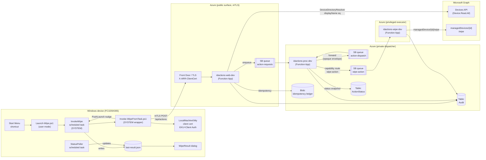
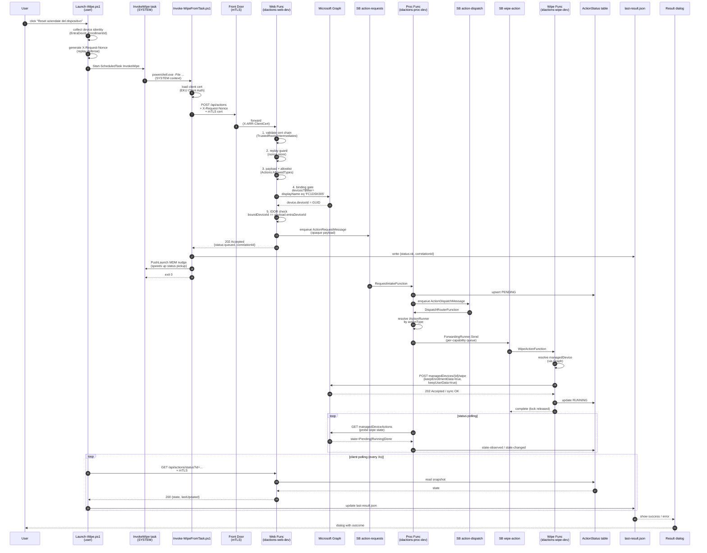

# Wipe request — end-to-end message flow

This document traces a single wipe request from the user's click on
**"Reset aziendale del dispositivo"** on a managed Windows device all the way
through to the Microsoft Graph `wipe` action that initiates the destructive
operation on Intune, and back to the user-facing result dialog.

It maps every component, every queue hop, every storage write, every cert
gate and every Graph permission that participates. Use it as the canonical
reference for incident response, capacity sizing, and onboarding.

> Snapshot: the trace below mirrors a real, successfully-executed request
> on `dev`:
> `correlationId = ce0b4cd5280b45d6931c5b017cae27ac` (2026-06-11 13:14:38 → 13:16:01 UTC).

---

## 1. Logical architecture



---

## 2. Sequence diagram (single happy path)



---

## 3. Stage-by-stage detail

### 3.1 Device — Launch-Wipe.ps1 (user mode)

| Aspect | Detail |
| --- | --- |
| Entry point | Start Menu shortcut `Reset aziendale del dispositivo.lnk` (created by `Install.ps1`) |
| Execution context | Logged-on user (NOT SYSTEM) — needed to render WPF dialogs |
| Responsibilities | (a) collect device identity (Entra device id, enrollment id, hostname); (b) generate `X-Request-Nonce` for replay defense; (c) start the SYSTEM scheduled task `InvokeWipe`; (d) poll `last-result.json` for the wrapper outcome; (e) render confirmation / progress / result dialogs |
| Breadcrumb | `%LOCALAPPDATA%\IntuneWipeClient\Logs\launcher-observation.json` (added v1.0.17) |

### 3.2 Device — InvokeWipe scheduled task → Invoke-WipeFromTask.ps1 (SYSTEM)

| Aspect | Detail |
| --- | --- |
| Trigger | Started on demand by `Launch-Wipe` (or by an operator via `Start-ScheduledTask`) |
| Action line | `powershell.exe -NoProfile -ExecutionPolicy Bypass -WindowStyle Hidden -File "C:\Program Files\IntuneWipeClient\Invoke-WipeFromTask.ps1"` |
| Responsibilities | (a) load the client cert from `LocalMachine\My` filtered by configured issuer; (b) build the JSON payload; (c) POST `/api/actions` over mTLS; (d) write the outcome to `last-result.json`; (e) send a local MDM `PushLaunch` nudge so Intune picks up state changes faster |
| Persistence | `C:\ProgramData\IntuneWipeClient\last-result.json` (also `wrapper-reached.txt` and `Logs\Task_*.log` transcripts via .NET IO for WDAC resilience) |
| Hard requirement | All source `.ps1` files MUST be ASCII or UTF-8 with BOM. PS 5.1 invoked as `-File` reads with system code page (CP1252) when no BOM is present; a single em-dash silently aborts with exit 1. (This was the root cause of the v1.0.15 silent-crash bug — fixed in v1.0.18.) |

### 3.3 Front Door / Function App ingress — mTLS

| Aspect | Detail |
| --- | --- |
| Resource | `idactions-web-dev` (Microsoft.Web/sites, Linux Function App) |
| TLS | mTLS enforced; the platform forwards the client cert as `X-ARR-ClientCert` header to the worker |
| Cert acceptance | `ClientCert:TrustedCaThumbprints` whitelist + `TrustedRootCertificates` / `TrustedIntermediateCertificates` for path validation |
| Configuration source | All `ClientCert:*` keys live in `idactions-appcfg-dev` (Azure App Configuration), surfaced via `AddIntuneDeviceActionsAppConfig("web")` at startup |

### 3.4 Web Function — `ActionRequestFunction.cs`

The HTTP handler is intentionally capability-agnostic. Order of gates
matters; each one fail-closes with a typed `action.denied.*` audit event.

```
1. ClientCertValidator.Validate
   → trust anchor, EKU Client Auth, optional revocation
2. ReplayProtector.Check
   → X-Request-Nonce vs nonce store (sliding window)
3. Payload + Actions:AllowedTypes allowlist
   → unknown actionType ⇒ 400
4. Certificate ↔ device binding (IDOR defense)
   → ClientCertValidator.GetBoundDeviceId (Auto mode):
       a) operator thumbprint→GUID map
       b) SAN URI = GUID literal
       c) SAN DNS = GUID literal
       d) Subject CN = GUID literal
       e) DeviceDirectoryResolver: SAN DNS FQDN → Graph
          /devices?$filter=displayName eq '<host>' → deviceId
   → boundDeviceId == payload.entraDeviceId else 401
5. IdempotencyLedger.TryClaim
   → duplicate replay ⇒ 200 (same correlationId)
6. ServiceBusSender.Send (action-requests queue)
   → 202 Accepted {status:queued, correlationId}
```

> **uamiWeb required Graph permission**: `Device.Read.All` (application).
> Granted via `tools/Grant-GraphPermissions.ps1`. Without it, step 4e
> fail-closes and ALL on-prem-PKI clients (cert with SAN=DNS FQDN, no
> embedded GUID) are rejected with a misleading
> `client certificate is missing the configured device-id binding claim`.

### 3.5 Proc Function — capability-agnostic dispatcher

| Function | Role |
| --- | --- |
| `RequestIntakeFunction` | Consumes `action-requests`. Persists initial status row (`PENDING`) to `ActionStatus` table. Forwards an `ActionDispatchMessage` to `action-dispatch` (W3C traceparent restored by `ServiceBusTraceContextMiddleware`). |
| `DispatchRouterFunction` | Consumes `action-dispatch`. Resolves `IActionRunner` by `actionType` via DI. For `wipe`, dispatches to `WipeForwardingRunner` which sends to the per-capability `wipe-action` queue. |
| `ActionStatusPoller` | Periodically probes `IActionStatusProbe` implementations (Wipe, Autopilot, BitLocker) against Graph; emits `action.state-observed` / `action.state-changed` audit events; updates `ActionStatus` table. |

### 3.6 Wipe Function — privileged executor (`idactions-wipe-dev`)

| Aspect | Detail |
| --- | --- |
| Trigger | `wipe-action` SB queue (passwordless, MI-bound) |
| Identity | `idactions-uami-wipe-dev` (privileged Graph: `DeviceManagementManagedDevices.PrivilegedOperations.All`, `…Read.All`, `Device.Read.All`, `GroupMember.Read.All`) |
| Graph call | `POST /deviceManagement/managedDevices/{managedDeviceId}/wipe` with `keepEnrollmentData=true, keepUserData=true` (corporate-data wipe, not full factory reset) |
| Sync fallback | If async issuance lingers `pending`, the runner retries up to 3× with 60s delay (`wipe.graph.sync-fallback.issued`) — normal behaviour, not an error |
| Audit | `wipe.action.consumed`, `wipe.graph.issued`, optional `wipe.graph.sync-fallback.issued`, `wipe.graph.completed` |

### 3.7 Status feedback to user

| Step | Path |
| --- | --- |
| Proc poller observes state | `ActionStatus` row updated (state column) |
| Device polls `/api/actions/status` | Client cert mTLS + IDOR re-check |
| `Launch-Wipe` reads `last-result.json` | Wrapper + poller both append updates; launcher renders progress |
| Final dialog | `WipeResultDialogs.ps1` (`Show-WipeSuccessDialog` / `Show-WipeErrorDialog` / `Show-WipeUnknownDialog` with `-ReasonHint`) |

> Direct `Start-ScheduledTask InvokeWipe` invocations bypass `Launch-Wipe`
> entirely — the SYSTEM task runs hidden, has no UI, and `Send-UserNotification`
> is a no-op stub by design (msg.exe / WTSSendMessage produce opaque popups
> and are disabled on Server SKUs). For user feedback, always go through
> the Start Menu shortcut.

---

## 4. Resources touched per request

| Layer | Resource (dev) | Purpose |
| --- | --- | --- |
| Identity | `idactions-uami-web-dev` | Graph `Device.Read.All` (binding resolver) + AppConfig reader + SB Sender on `action-requests` |
| Identity | `idactions-uami-dev` | Proc dispatcher — SB Receiver/Sender + Graph poller |
| Identity | `idactions-uami-wipe-dev` | Privileged Graph for the wipe executor |
| Function App | `idactions-web-dev` | HTTP intake (mTLS) |
| Function App | `idactions-proc-dev` | Dispatcher + status poller |
| Function App | `idactions-wipe-dev` | Privileged wipe executor |
| Service Bus | `idactions-sb-dev` / `action-requests` | Web → Proc handoff |
| Service Bus | `idactions-sb-dev` / `action-dispatch` | Proc routing fabric |
| Service Bus | `idactions-sb-dev` / `wipe-action` | Proc → Wipe per-capability queue |
| Storage | `idactionsstpdev` / Tables | `ActionStatus`, `Audit` (cross-account write from Web) |
| Storage | `idactionsstwdev` / Blobs | Idempotency ledger |
| App Configuration | `idactions-appcfg-dev` | All runtime settings (ClientCert, Actions, Graph, SB, etc.) |
| App Insights | `idactions-ai-dev` | `customEvents` (audit), `traces`, `exceptions`, OTel dependencies |
| Microsoft Graph | `devices` endpoint | Resolve `displayName` → `deviceId` for cert binding (Web) |
| Microsoft Graph | `managedDevices/{id}/wipe` | Issue the destructive action (Wipe) |

---

## 5. Failure modes and their audit fingerprint

| Symptom | Audit event | Root cause |
| --- | --- | --- |
| 400 `missing X-Request-Nonce` | `action.denied.replay` | Client didn't generate / send the nonce |
| 401 `cert-validation` | `action.denied.cert-validation` | Cert chain / EKU / revocation failure |
| 401 `cert-binding-missing` | `action.denied.cert-binding-missing` | Binding resolver returned null. With an FQDN-bearing cert this is almost always a Graph permission gap on `uamiWeb` (`Device.Read.All` missing) — confirm with `Directory lookup failed for displayName='…'; fail-closed` in traces |
| 401 `cert-device-mismatch` | `action.denied.cert-device-mismatch` | `boundDeviceId != payload.entraDeviceId` (cert belongs to a different device) |
| 400 `type-not-allowed` | `action.denied.type-not-allowed` | `actionType` not in `Actions:AllowedTypes` (App Config) |
| 400 `payload-invalid` | `action.denied.payload-invalid` | Missing/invalid `entraDeviceId`, `deviceName`, etc. |
| Silent client crash, no `last-result.json`, `LastTaskResult=1` | n/a | Non-ASCII char in a `.ps1` saved without BOM → PS 5.1 `-File` parser crash. Save scripts as ASCII or UTF-8 BOM. |
| `wipe.graph.sync-fallback.issued` | (info) | Normal: async wipe lingered `pending`, runner is retrying. Up to 3 attempts. |

---

## 6. Worked example — trace from the canonical successful request

```
13:14:38  Web   action.request.received       corr=ce0b4cd5…
13:14:40  Web   action.request.accepted       cert-binding OK (FQDN→GUID via Graph)
13:14:41  Proc  action.dispatch.enqueued
13:14:41  Proc  action.dispatch.received
13:14:41  Proc  action.forwarded              wipe-action queue
13:14:41  Proc  action.dispatch.completed
13:14:41  Wipe  wipe.action.consumed
13:14:45  Wipe  wipe.graph.issued             managedDeviceId=3b6f7b2b-…
13:15:46  Wipe  wipe.graph.sync-fallback.issued  attempt 1/3
13:16:01  Proc  action.state-observed         prev=pending
13:16:01  Proc  action.state-changed
```

Total wall-clock from POST to first state transition: **83 seconds**.
Device reboot + factory wipe (corp-data) followed.

---

## 7. References

- `src/Web/Functions/ActionRequestFunction.cs` — the HTTP intake and gates
- `src/Shared/Services/ClientCertValidator.cs` — cert + binding gate
- `src/Shared/Services/DeviceDirectoryResolver.cs` — FQDN → Entra deviceId lookup
- `src/Proc/Functions/RequestIntakeFunction.cs` — SB consumer + dispatcher
- `src/Capabilities.Wipe/Runners/WipeRunner.cs` — privileged executor
- `tools/Grant-GraphPermissions.ps1` — UAMI Graph permission grants
- `client/intune-win32-package/source/Invoke-WipeFromTask.ps1` — SYSTEM wrapper
- `client/intune-win32-package/source/Launch-Wipe.ps1` — user-mode launcher
- `infra/main.bicep` — full Azure topology (UAMIs, role assignments, queues, plans)
